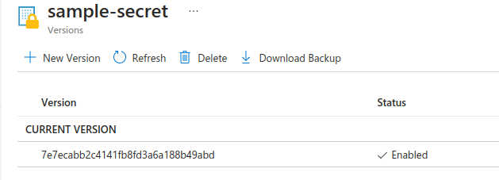
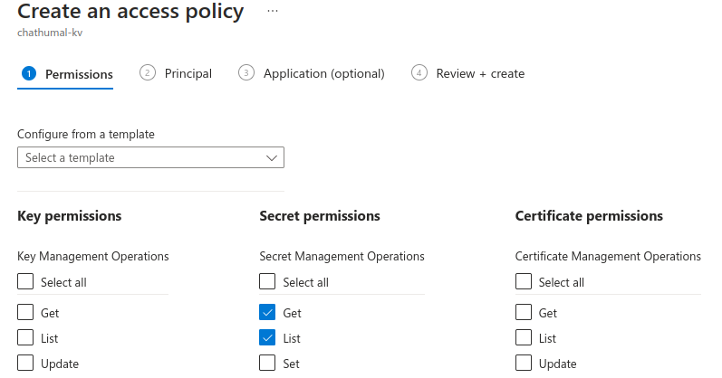

# Integrating Azure Key-Vault with AKS using Azure Key Vault provider for Secrets Store CSI Driver


This project outlines the process of integrating Azure Key Vault with an AKS (Azure Kubernetes Service) cluster using the Azure Key Vault Provider for Secrets Store CSI Driver.


## AKS Creation and Configuration

> Please note that all the following commands are designed for the Bash shell.


First we need to provide the followign environemant  variables since they will be used in several occasions. 


```
RESOURCE_GROUP="demo-resource-group"
CLUSTER_NAME="demo-cluster"
KEY_VAULT_NAME="demo-key-vault-name"
SUBSCRIPTION_ID=$(az account show --query id --output tsv)
```

Begin by creating an Azure resource group, which will organize the resources generated throughout this project. Adding a "owner=az-cli" tag helps identify resources created via the CLI.

```
az group create -l eastus -n $RESOURCE_GROUP --tags "owner=az-cli"
```

Then we need to create an Azure Kubernetes Cluster with following specs.

- Free tier
- OIDC issuer should be enabled
- Azure Key Vault secret provider add-on should be enabled
- Work load identity should be enabled 

I have utilzed the cluster creation to keep a very lowe cluster cost, so there may be additional arguments provided here. More details can be found from the official aks clustre creation [command](https://learn.microsoft.com/en-us/cli/azure/aks?view=azure-cli-latest#az-aks-create).

```
az aks create --name $CLUSTER_NAME -g $RESOURCE_GROUP  --tier free --node-count 1 --node-vm-size Standard_B2s --enable-oidc-issuer  --network-plugin azure --load-balancer-sku basic --node-osdisk-size 30  --tags "owner=az-cli" --no-wait --enable-addons azure-keyvault-secrets-provider  --enable-workload-identity 
```

Retrieve cluster credentials and use the kubelogin plugin for cluster authentication.

```
az aks get-credentials --resource-group $RESOURCE_GROUP --name $CLUSTER_NAME --overwrite-existing
```

```
kubelogin convert-kubeconfig -l azurecli
```

Verify proper authentication with the cluster.
```
kubectl get nodes

kubectl get pods -A
```


## Azure Key Vault creation


Use the following command to create an Azure Key vault.

```sh
az keyvault create -n $KEY_VAULT_NAME -g $RESOURCE_GROUP -l eastus --enable-rbac-authorization
```

Create a sample secret.

```
az keyvault secret set --name sample-secret --vault-name $KEY_VAULT_NAME --value sample-secret-value
```




## Granting access to managed identity.

When we create an AKS, the AKS related components are created under a **separate resource group** and managed identities will be created automatically with the names `azurekeyvaultsecretsprovider-<cluster name>` and `<cluster name>-agentpool`. This is not the resource group refledcted by `$RESOURCE_GROUP`.

We can create a separate managed idenity without using the automatically created one.

```
IDENTITY_NAME="azurekeyvaultsecretsprovider-$CLUSTER_NAME"

az identity create --name $IDENTITY_NAME --resource-group $RESOURCE_GROUP

```

Now this `azurekeyvaultsecretsprovider-<cluster name>` managed-identity needs to be configured to access the key-vault and that can be done in  several ways.

1. Assign RBAC role to the managed-idenity to perform `get` and `list` operations in the key-vault.
2. Create key-vault access policy to the managed-idenity to perform `get` and `list` operations in the key-vault.

Let's go with creating a key-vault access policy.

This can be done using the portal,by going to the key-vault that created above.
Then select **Access policies**, and create an access policy. Select `get` and `list` permissions for secrets. Now select the above created managed identity name.




 ## Setup Federation

Now we need to create a trust relationship between the AKS cluster and the managed identity.

In order to do that we need to have
1. Service account 
2. AKS cluster OIDC issuer URL

Lets obtain the AKS cluster OIDC issuer URL first.

```
AKS_OIDC_ISSUER="$(az aks show --resource-group $RESOURCE_GROUP --name $CLUSTER_NAME --query "oidcIssuerProfile.issuerUrl" -o tsv)"
```

Create a new namespace.

```
NAMESPACE="kv-demo"

kubectl create ns $NAMESPACE
```
Obtain the client id of the identity.

```
CLIENT_ID=$(az identity show --resource-group  $RESOURCE_GROUP  --name $IDENTITY_NAME --query clientId --output tsv)

```


Now create a service account.

```
SERVICE_ACCOUNT_NAME="workload-identity-sa"


cat <<EOF | kubectl apply -f -
apiVersion: v1
kind: ServiceAccount
metadata:
  annotations:
    azure.workload.identity/client-id: ${CLIENT_ID}
  name: ${SERVICE_ACCOUNT_NAME}
  namespace: ${NAMESPACE}
EOF
```

Setup the federation.

```
FEDERATED_IDENTITY_NAME="aksfederatedidentity"

az identity federated-credential create --name $FEDERATED_IDENTITY_NAME --identity-name $IDENTITY_NAME --resource-group $RESOURCE_GROUP --issuer ${AKS_OIDC_ISSUER} --subject system:serviceaccount:${NAMESPACE}:${SERVICE_ACCOUNT_NAME}

```

## Create the Secret Provider Class

```
TENANT_ID=$(az keyvault show -n $KEY_VAULT_NAME -g $RESOURCE_GROUP --query "properties.tenantId" -o tsv)


cat <<EOF | kubectl apply -f -
apiVersion: secrets-store.csi.x-k8s.io/v1
kind: SecretProviderClass
metadata:
  name: azure-kvname-wi
  namespace: ${NAMESPACE}
spec:
  provider: azure
  parameters:
    usePodIdentity: "false"
    clientID: "${CLIENT_ID}"                # include the client-id of the managed identity
    keyvaultName: ${KEY_VAULT_NAME}        
    cloudName: ""                           # [OPTIONAL for Azure] if not provided, the Azure environment defaults to AzurePublicCloud
    objects:  |
      array:
        - |
          objectName: sample-secret         # Set the name of the secret
          objectType: secret                # object types: secret, key, or cert
          objectVersion: ""                 # [OPTIONAL] object versions, default to latest if empty.
    tenantId: "${TENANT_ID}"                # The tenant ID of the key vault
EOF
```

## Verifying Key-vault AKS integration

Now a sampel pod should be created to mount the secrets.

```yaml
kind: Pod
apiVersion: v1
metadata:
  name: busybox-secrets-store-inline-wi
  namespace: ${NAMESPACE}
  labels:
    azure.workload.identity/use: "true"
spec:
  serviceAccountName: ${SERVICE_ACCOUNT_NAME}
  containers:
    - name: busybox
      image: registry.k8s.io/e2e-test-images/busybox:1.29-4
      command:
        - "/bin/sleep"
        - "10000"
      volumeMounts:
      - name: secrets-store01-inline
        mountPath: "/mnt/secrets-store"
        readOnly: true
  volumes:
    - name: secrets-store01-inline
      csi:
        driver: secrets-store.csi.k8s.io
        readOnly: true
        volumeAttributes:
          secretProviderClass: "azure-kvname-wi"
```

Now the secret will be mounted the location specified in 'mountpath'.

Check all the mounted components in the given path.

```
kubectl exec -n $NAMESPACE busybox-secrets-store-inline-wi -- ls /mnt/secrets-store/
```

now you may see the secretname that we mentioned in the `SecretProviderClass` resource (sample-secret).

Verify the secret content by,
```
kubectl exec -n $NAMESPACE busybox-secrets-store-inline-wi -- cat /mnt/secrets-store/sample-secret
```

## Clean up the resources

```
az aks delete --name $CLUSTER_NAME  --resource-group $RESOURCE_GROUP --no-wait
az group delete -n $RESOURCE_GROUP --no-wait
```


## References

- [AZ CLI documentation](https://learn.microsoft.com/en-us/cli/azure/reference-index?view=azure-cli-latest)
- [Azure links with integration]()
- [Abishek weeramalla utube tutorial](https://www.youtube.com/watch?v=MJ97ZInCXgY&list=PLdpzxOOAlwvIcxgCUyBHVOcWs0Krjx9xR&index=21&pp=iAQB)