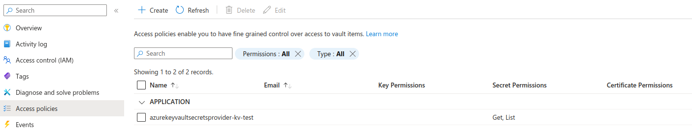
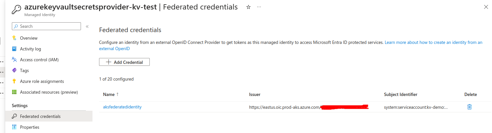
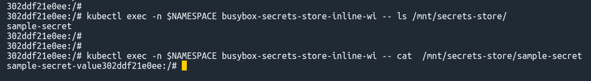

# Integrating Azure Key-Vault with AKS using Azure Key Vault provider for Secrets Store CSI Driver


This project outlines the process of integrating Azure Key Vault with an AKS (Azure Kubernetes Service) cluster using the Azure Key Vault Provider for Secrets Store CSI Driver.

**Table of Contents**
- [Integrating Azure Key-Vault with AKS using Azure Key Vault provider for Secrets Store CSI Driver](#integrating-azure-key-vault-with-aks-using-azure-key-vault-provider-for-secrets-store-csi-driver)
  - [AKS Creation and Configuration](#aks-creation-and-configuration)
  - [Azure Key Vault creation](#azure-key-vault-creation)
  - [Granting access to managed identity.](#granting-access-to-managed-identity)
  - [Setup Federation](#setup-federation)
  - [Create the Secret Provider Class](#create-the-secret-provider-class)
  - [Verifying Key-vault AKS integration](#verifying-key-vault-aks-integration)
  - [Clean up the resources](#clean-up-the-resources)
  - [References](#references)


## AKS Creation and Configuration

> Please note that all the following commands are designed for the Bash shell.


First, we need to provide the following environmant variables since they will be used on several occasions. 


```
RESOURCE_GROUP="kv-test"
CLUSTER_NAME="kv-test"
KEY_VAULT_NAME="demo-key-vault-name"
SUBSCRIPTION_ID=$(az account show --query id --output tsv)
```

> Vault name should be globally unique.

Begin by creating an Azure resource group, which will organize the resources generated throughout this project.

```
az group create -l eastus -n $RESOURCE_GROUP"
```

Then we need to create an Azure Kubernetes Cluster with the following specs.

- Free tier
- OIDC issuer should be enabled
- Azure Key Vault secret provider add-on should be enabled
- Work load identity should be enabled 

I have utilized the cluster creation to keep a very low cluster cost, so there may be additional arguments provided here. More details can be found from the official aks clustre creation [command](https://learn.microsoft.com/en-us/cli/azure/aks?view=azure-cli-latest#az-aks-create). Adding a "owner=az-cli" tag helps identify resources created via the CLI.

```
az aks create --name $CLUSTER_NAME -g $RESOURCE_GROUP  --tier free --node-count 1 --node-vm-size Standard_B2s --enable-oidc-issuer  --network-plugin azure --load-balancer-sku basic --node-osdisk-size 30  --tags "owner=az-cli" --no-wait --enable-addons azure-keyvault-secrets-provider  --enable-workload-identity 
```

Retrieve cluster credentials and use the kubelogin plugin for cluster authentication.

```
az aks get-credentials --resource-group $RESOURCE_GROUP --name $CLUSTER_NAME --overwrite-existing
```

```
kubelogin convert-kubeconfig -l azurecli
```

Verify proper authentication with the cluster.
```
kubectl get nodes

kubectl get pods -A
```


## Azure Key Vault creation


Use the following command to create an Azure Key vault.

```sh
az keyvault create -n $KEY_VAULT_NAME -g $RESOURCE_GROUP -l eastus
```

Create a sample secret.

```
az keyvault secret set --name sample-secret --vault-name $KEY_VAULT_NAME --value sample-secret-value
```


## Granting access to managed identity.

When we create an AKS, the AKS-related components are created under a **separate resource group** and managed identities will be created automatically with the names `azurekeyvaultsecretsprovider-<cluster name>` and `<cluster name>-agentpool`. This is not the resource group reflected by `$RESOURCE_GROUP`.

We can create a separate managed identity without using the automatically created one.

```
IDENTITY_NAME="azurekeyvaultsecretsprovider-$CLUSTER_NAME"

az identity create --name $IDENTITY_NAME --resource-group $RESOURCE_GROUP

```

Now this `azurekeyvaultsecretsprovider-<cluster name>` managed-identity needs to be configured to access the key-vault and that can be done in several ways.

1. Assign RBAC role to the managed-idenity to perform `get` and `list` operations in the key-vault.
2. Create key-vault access policy to the managed-idenity to perform `get` and `list` operations in the key-vault.

Let's proceed with creating a key-vault access policy and refer the documents mentioned at the end of this document to figure out how to do the same thing by assigning RBAC roles.

This can also be accomplished through the Azure portal by navigating to the previously created Key Vault.

Then select **Access policies**, and create an access policy. Select `get` and `list` permissions for secrets. Now select the above created managed identity name.


To do this process using CLI,

Acquire the object-id of the managed-identity

```
OBJECT_ID=$(az identity show --resource-group  $RESOURCE_GROUP  --name $IDENTITY_NAME --query principalId --output tsv)
```

Set the key-vault access-policy

```
az keyvault set-policy --name $KEY_VAULT_NAME --secret-permissions get list -g $RESOURCE_GROUP --object-id $OBJECT_ID
```

You can verify from the portal,




 ## Setup Federation

Now we need to create a trust relationship between the AKS cluster and the managed identity.

To do that we need to have
1. Service account 
2. AKS cluster OIDC issuer URL

Let's obtain the AKS cluster OIDC issuer URL first.

```
AKS_OIDC_ISSUER="$(az aks show --resource-group $RESOURCE_GROUP --name $CLUSTER_NAME --query "oidcIssuerProfile.issuerUrl" -o tsv)"
```

Create a new namespace.

```
NAMESPACE="kv-demo"

kubectl create ns $NAMESPACE
```
Obtain the client id of the identity.

```
CLIENT_ID=$(az identity show --resource-group  $RESOURCE_GROUP  --name $IDENTITY_NAME --query clientId --output tsv)

```


Now create a service account.

```
SERVICE_ACCOUNT_NAME="workload-identity-sa"


cat <<EOF | kubectl apply -f -
apiVersion: v1
kind: ServiceAccount
metadata:
  annotations:
    azure.workload.identity/client-id: ${CLIENT_ID}
  name: ${SERVICE_ACCOUNT_NAME}
  namespace: ${NAMESPACE}
EOF
```

Setup the federation.

```
FEDERATED_IDENTITY_NAME="aksfederatedidentity"

az identity federated-credential create --name $FEDERATED_IDENTITY_NAME --identity-name $IDENTITY_NAME --resource-group $RESOURCE_GROUP --issuer ${AKS_OIDC_ISSUER} --subject system:serviceaccount:${NAMESPACE}:${SERVICE_ACCOUNT_NAME}

```

Verify using the portal. Go to **Managed Identities** -> Select the identity -> **Federated credentials**



This means what ever permission this managed-idenity holds, will be inherited to the kubernetes service account. A pod can access the related Azure resources by using this service account.


## Create the Secret Provider Class

```
TENANT_ID=$(az keyvault show -n $KEY_VAULT_NAME -g $RESOURCE_GROUP --query "properties.tenantId" -o tsv)


cat <<EOF | kubectl apply -f -
apiVersion: secrets-store.csi.x-k8s.io/v1
kind: SecretProviderClass
metadata:
  name: azure-kvname-wi
  namespace: ${NAMESPACE}
spec:
  provider: azure
  parameters:
    usePodIdentity: "false"
    clientID: "${CLIENT_ID}"                # include the client-id of the managed identity
    keyvaultName: ${KEY_VAULT_NAME}        
    cloudName: ""                           # [OPTIONAL for Azure] if not provided, the Azure environment defaults to AzurePublicCloud
    objects:  |
      array:
        - |
          objectName: sample-secret         # Set the name of the secret
          objectType: secret                # object types: secret, key, or cert
          objectVersion: ""                 # [OPTIONAL] object versions, default to latest if empty.
    tenantId: "${TENANT_ID}"                # The tenant ID of the key vault
EOF
```

## Verifying Key-vault AKS integration

Now a sample pod should be created to mount the secrets.

```
cat <<EOF | kubectl apply -f -
kind: Pod
apiVersion: v1
metadata:
  name: busybox-secrets-store-inline-wi
  namespace: ${NAMESPACE}
  labels:
    azure.workload.identity/use: "true"
spec:
  serviceAccountName: ${SERVICE_ACCOUNT_NAME}
  containers:
    - name: busybox
      image: registry.k8s.io/e2e-test-images/busybox:1.29-4
      command:
        - "/bin/sleep"
        - "10000"
      volumeMounts:
      - name: secrets-store01-inline
        mountPath: "/mnt/secrets-store"
        readOnly: true
  volumes:
    - name: secrets-store01-inline
      csi:
        driver: secrets-store.csi.k8s.io
        readOnly: true
        volumeAttributes:
          secretProviderClass: "azure-kvname-wi"
EOF
```

Now the secret will be mounted in the location specified in 'mountpath'.

Check all the mounted components in the given path.

```
kubectl exec -n $NAMESPACE busybox-secrets-store-inline-wi -- ls /mnt/secrets-store/
```

now you may see the secret name that we mentioned in the `SecretProviderClass` resource (sample-secret).

Verify the secret content by,
```
kubectl exec -n $NAMESPACE busybox-secrets-store-inline-wi -- cat /mnt/secrets-store/sample-secret
```




## Clean up the resources

```
az aks delete --name $CLUSTER_NAME  --resource-group $RESOURCE_GROUP --no-wait
az group delete -n $RESOURCE_GROUP --no-wait
```


## References

- [AZ CLI documentation](https://learn.microsoft.com/en-us/cli/azure/reference-index?view=azure-cli-latest)
- [Azure official documentation to implement CSI secrets store driver](https://learn.microsoft.com/en-us/azure/aks/csi-secrets-store-driver)
- [Abishek Weeramalla - YouTube tutorial](https://www.youtube.com/watch?v=MJ97ZInCXgY&list=PLdpzxOOAlwvIcxgCUyBHVOcWs0Krjx9xR&index=21&pp=iAQB)